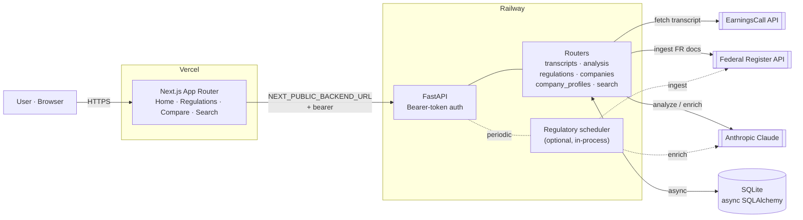
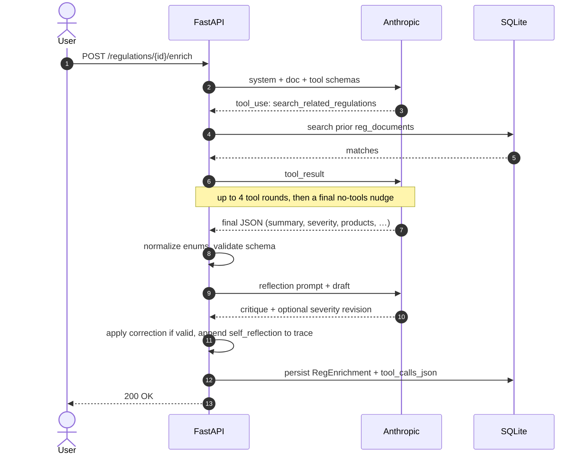

# Stock Intelligence Dashboard

[](https://github.com/jdmc24/stock-intelligence-dashboard/actions/workflows/evals.yml)

Full-stack app for **public-equities research**: pull **earnings call transcripts**, monitor **Federal Register** regulatory activity, and run **LLM-backed analysis** (Anthropic Claude). The regulatory enrichment path is a tool-using Claude agent with a self-reflection step and persisted reasoning traces. Monorepo with a Next.js UI and FastAPI API; SQLite for the data store.

| | |
|---|---|
| **Live app** | [stock-intelligence.io](https://stock-intelligence.io) — production UI on Vercel |
| **API** | FastAPI on Railway; OpenAPI docs at `/docs` on the host the production UI calls (see **Network** in browser devtools) |
| **Source** | [github.com/jdmc24/stock-intelligence-dashboard](https://github.com/jdmc24/stock-intelligence-dashboard) |

## What it does

- **Earnings** — Fetch a transcript by ticker and quarter (EarningsCall API), then run **four specialist Claude analyses in parallel**: per-section **sentiment** with confidence/defensiveness/specificity/urgency sub-scores, **hedging detection** across six linguistic categories, **forward-looking guidance** extraction (metric, direction, timeframe, conditions), and **topic tagging** against a fixed financial-services taxonomy (NIM, capital ratios, credit quality, etc.).
- **Regulations** — Ingest Federal Register documents on a schedule (or on demand), then enrich each with a **tool-using Claude agent** that can search prior regulations, look up company profiles, and **self-reflect** on its own draft before producing structured output. The agent's reasoning trace is persisted to SQLite and rendered as a collapsible panel on the document detail page.
- **Compare & search** — Cross-cut views over stored content; see the app nav.

## Agentic patterns

The regulatory enrichment path is the project's agentic core. Five patterns are implemented and observable end-to-end:

| Pattern | What it does | Where in the code |
|---|---|---|
| **Tool use** | Claude decides per-document whether to call `search_related_regulations` or `lookup_company_profile`; capped at 4 rounds | `backend/app/services/llm/regulatory_tools.py`, `anthropic_client.py:complete_json_with_tools_and_usage` |
| **Reasoning trace** | Every tool call (name, input, output, error) is logged and surfaced in the UI | `reg_enrichments.tool_calls_json`, `frontend/src/components/regulations/AgentReasoningTrace.tsx` |
| **Reflection pass** | A second Claude call critiques its own draft; runtime applies severity corrections deterministically | `backend/app/services/regulations_enrichment.py:_run_reflection` |
| **Bounded autonomy** | Two read-only tools, severity-only auto-correction, hard iteration cap — no autonomous external actions | enforced in the runtime; structured fields are normalized once |
| **Deterministic evals + CI** | Fixture-based suite scores both final output and trace; runs on every PR that touches the agent path | `backend/app/evals/`, `.github/workflows/evals.yml` |

## Architecture

### Topology



The LLM is one of three I/O dependencies (EarningsCall, Federal Register, Anthropic). Persistence is a single SQLite database accessed asynchronously; the scheduler is optional and runs in-process.

### Agent loop (regulatory enrichment)



This second diagram is the part most reviewers want to see — the model decides what to look up, the runtime executes and feeds results back, and a deterministic post-step reviews the draft. Every step is logged and rendered in the UI.

## Stack

- **Frontend:** Next.js (App Router), TypeScript, Tailwind.
- **Backend:** FastAPI, async SQLAlchemy, SQLite (`aiosqlite`).
- **AI:** Anthropic API (configurable model).
- **Production:** API on **Railway**, UI on **Vercel** — details in [`DEPLOYMENT.md`](./DEPLOYMENT.md).

## Repo layout

```
backend/app/
  routers/           # FastAPI routers (transcripts, analysis, regulations, …)
  services/
    llm/             # Anthropic client + regulatory tool dispatcher
    analysis_runner.py
    regulations_enrichment.py
    regulatory_scheduler.py
    …
  prompts/           # Versioned system + user prompts (PROMPT_VERSION)
  evals/             # Fixture-based agent eval suite (see backend/app/evals/README.md)
  models.py          # SQLAlchemy ORM
frontend/src/
  app/               # Next.js App Router pages
  components/        # UI components (incl. AgentReasoningTrace)
  lib/               # API client + types
docs/prds/           # Original product requirements docs
```

## Local development

**1. Backend**

```bash
cd backend
python3 -m venv .venv
source .venv/bin/activate
pip install -r requirements.txt
cp ../.env.example .env     # fill in keys; see comments in file
uvicorn app.main:app --reload --port 8000
```

Open [http://localhost:8000/docs](http://localhost:8000/docs).

**2. Frontend**

```bash
cd frontend
npm install
cp ../.env.example .env.local   # point NEXT_PUBLIC_BACKEND_URL at the API
npm run dev
```

Open [http://localhost:3000](http://localhost:3000).

## Configuration

All variables are documented in [`.env.example`](./.env.example). Minimum for meaningful local runs: backend secrets for **Anthropic**, **EarningsCall** (beyond demo tickers), and matching **`API_BEARER_TOKEN`** / **`NEXT_PUBLIC_API_BEARER_TOKEN`**.

## Deploy

**Railway** (API) + **Vercel** (frontend, root directory `frontend`): env vars, volumes, and ordering are in [`DEPLOYMENT.md`](./DEPLOYMENT.md). Viewers use the live URL only; they do not need to deploy the repo.

## Evals

The agent path is covered by a fixture-based deterministic eval suite. Five Federal Register documents (capital, cyber, fair-lending, BSA/AML, procedural) are scored on **final-output assertions** (severity bucket, change-type enum, products/functions overlap, summary keyword presence + minimum length) and **trace-level assertions** (must-call-tool, must-have-reflection-entry). Runs in ~3 minutes for under $0.15.

```bash
cd backend
python -m app.evals.runner --dry     # validate fixtures + scoring (no API cost)
python -m app.evals.runner            # full suite (needs ANTHROPIC_API_KEY)
```

The suite runs automatically on PRs that touch the agent path; see [`.github/workflows/evals.yml`](./.github/workflows/evals.yml) and [`backend/app/evals/README.md`](./backend/app/evals/README.md) for details.

## Background

Original pre-build product requirements docs (scoping, user personas, feature prioritization) live in [`docs/prds/`](./docs/prds/). They reflect the planning that preceded the build and are kept for portfolio context, not as current spec.

---

If you only attached `www` in Vercel, use [www.stock-intelligence.io](https://www.stock-intelligence.io) (or add an apex ↔ `www` redirect).
