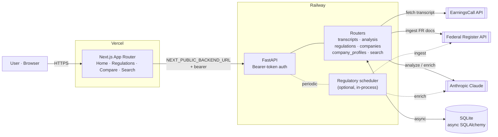

# Stock Intelligence Dashboard

[](https://github.com/jdmc24/stock-intelligence-dashboard/actions/workflows/evals.yml)

Full-stack app for **public-equities research**: pull **earnings call transcripts**, monitor **Federal Register** regulatory activity, and run **LLM-backed analysis** (Anthropic Claude). Monorepo with a Next.js UI and FastAPI API; SQLite for a simple local data store.

| | |
|---|---|
| **Live app** | [stock-intelligence.io](https://stock-intelligence.io) — production UI (Vercel). Use the same URL in GitHub → repo **About** → **Website**. |
| **API** | **Backend:** FastAPI on **Railway**; the public base URL is the same host the production UI calls (see **Network** in browser devtools). OpenAPI/Swagger is at `/docs` on that host. |
| **Source** | [github.com/jdmc24/stock-intelligence-dashboard](https://github.com/jdmc24/stock-intelligence-dashboard) |

If you only attached **`www`** in Vercel, use [www.stock-intelligence.io](https://www.stock-intelligence.io) instead (or add a redirect between apex and `www`).

## What it does

- **Earnings** — Fetch transcripts (EarningsCall API), store them, run structured analysis.
- **Regulations** — Ingest and browse regulatory items; company-facing regulatory angles.
- **Compare & search** — Cross-cut views over stored content (see app nav).

## Architecture



The LLM is one of three I/O dependencies (EarningsCall, Federal Register, Anthropic). Persistence is a single SQLite database accessed asynchronously; the scheduler is optional and runs in-process.

## Stack

- **Frontend:** Next.js (App Router), TypeScript, Tailwind.
- **Backend:** FastAPI, async SQLAlchemy, SQLite (`aiosqlite`) for dev/single-node deploys.
- **AI:** Anthropic API (configurable model).
- **Production (typical):** API on **Railway**, UI on **Vercel** — details in [`DEPLOYMENT.md`](./DEPLOYMENT.md).

## Repo layout

```
backend/    # FastAPI — `uvicorn app.main:app`
frontend/   # Next.js — `npm run dev`
```

## Local development

**1. Backend**

```bash
cd backend
python3 -m venv .venv
source .venv/bin/activate   # Windows: .venv\Scripts\activate
pip install -r requirements.txt
cp ../.env.example .env     # fill in keys; see comments in file
uvicorn app.main:app --reload --port 8000
```

Open [http://localhost:8000/docs](http://localhost:8000/docs).

**2. Frontend**

```bash
cd frontend
npm install
cp ../.env.example .env.local   # point NEXT_PUBLIC_BACKEND_URL at the API
npm run dev
```

Open [http://localhost:3000](http://localhost:3000).

## Configuration

All variables are documented in [`.env.example`](./.env.example). Minimum for meaningful local runs: backend secrets for **Anthropic**, **EarningsCall** (beyond demo tickers), and matching **`API_BEARER_TOKEN`** / **`NEXT_PUBLIC_API_BEARER_TOKEN`**.

## Deploy

**Railway** (API) + **Vercel** (frontend, root directory `frontend`): env vars, volumes, and ordering are in [`DEPLOYMENT.md`](./DEPLOYMENT.md). Viewers use the **live URLs** only; they do not need to deploy the repo.

## Evals

The LLM-backed regulatory enrichment path is covered by a small **fixture-based eval suite** in [`backend/app/evals/`](./backend/app/evals/). Five Federal Register documents (capital, cyber, fair-lending, BSA/AML, procedural) are scored on:

- **Final-output assertions** — severity bucket, change-type enum, products/functions overlap, summary keyword presence + minimum length.
- **Trace-level assertions** — did the agent call the right tool? did the reflection pass run?

Scoring is deterministic (no LLM-as-judge), runs in an isolated SQLite database, and surfaces regressions in ~3 minutes for under $0.15. The suite runs automatically on PRs that touch the agent path; see [`.github/workflows/evals.yml`](./.github/workflows/evals.yml).

```bash
cd backend
python -m app.evals.runner --dry     # validate fixtures + scoring without API cost
python -m app.evals.runner            # full suite (needs ANTHROPIC_API_KEY)
```
